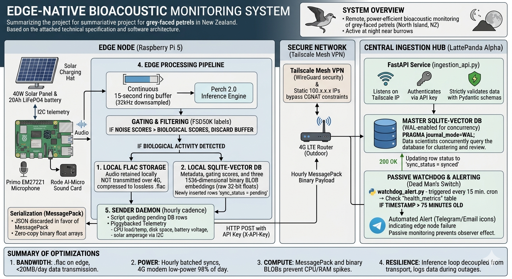

# Edge Bioacoustics

Edge Bioacoustics is a project for remote, low-bandwidth acoustic monitoring of
grey-faced petrels and other North Island New Zealand birds. The system is
designed to capture field audio at the edge, run Perch 2.0 inference locally,
save only selected audio clips, and synchronize compact metadata, logits,
telemetry, and vector embeddings back to a central hub.

The core design goal is simple: keep the field node useful even when power,
storage, weather, and cellular data are all constrained.



## Project Status

The project is currently in Phase 1: desktop mock development.

Phase 1 builds and tests the full software path locally before moving to real
Raspberry Pi hardware, field microphones, Tailscale networking, 4G transport,
I2C telemetry, and systemd services.

Current Phase 1 progress:

- Desktop mock workspace layout, config templates, dependency files, and
  SQLite setup scripts are in place.
- The configured AR4 mock audio path is
  `/data/petrel_acoustics/raw_audio/doc_ar4/rapanui_AR4_june_2023`.
- Perch CPU V2 inference has been confirmed locally: three 5-second frames from
  one 15-second buffer produce logits shaped `[3, 14795]` and embeddings shaped
  `[3, 1536]`.
- `bio_capture_loop.py` is implemented for bounded desktop runs against raw
  mock audio.
- A teaching notebook walks through the capture loop step by step:
  [notebooks/04A_bio_capture_loop_walkthrough.ipynb](notebooks/04A_bio_capture_loop_walkthrough.ipynb).
- The notebook uses a bundled 120-second teaching clip:
  [notebooks/example_audio/example1_120s_petrel.wav](notebooks/example_audio/example1_120s_petrel.wav).

The current implementation plan is here:

[docs/02_implementation/Phase_1_implementation_plan.md](docs/02_implementation/Phase_1_implementation_plan.md)

## System Overview

The planned system has two main sides.

The edge node is a Raspberry Pi 5 in the field. It captures 48 kHz audio,
processes it as 15-second buffers, downsamples to 32 kHz for Perch 2.0, and
evaluates the three 5-second Perch frames independently. Each buffer produces
metadata, biological and noise scores, NZ bird subset scores, and three
1536-dimensional embeddings.

The central hub is a LattePanda Alpha on a secure home network. It receives
hourly MessagePack batches from the edge node, validates them with a FastAPI
ingestion service, writes them into a WAL-enabled SQLite database, and monitors
device health with a passive watchdog.

## Runtime Components

The architecture is built around four scripts:

1. `edge_node_mock/src/bio_capture_loop.py`: implemented edge audio buffering, Perch inference, gating, audio retention, and edge database writes.
2. `sender_daemon.py`: planned edge database sync, MessagePack serialization, mock or real telemetry, and HTTP transport.
3. `ingestion_api.py`: planned hub-side FastAPI receiver, API key authentication, payload validation, and master database insertion.
4. `watchdog_alert.py`: planned hub-side stale telemetry detection and alerting.

Supporting scripts currently include:

- `edge_node_mock/src/audio_smoke_test.py`: confirms configured mock audio can be read.
- `edge_node_mock/src/init_edge_db.py`: initializes the edge SQLite database.
- `edge_node_mock/src/inspect_perch_model.py`: verifies Perch model input/output shapes and label mappings.
- `central_hub_mock/src/init_master_db.py`: initializes the hub SQLite database.

## Data Strategy

Raw recordings are treated as read-only evidence. During desktop development,
mock `.wav` recordings are read from a YAML-configured path under `/data`.
The current AR4 fixture recordings are mono 32 kHz WAV files. The capture loop
also keeps the planned 48 kHz to 32 kHz downsampling path for future sources.

Large raw recordings remain outside Git. A small curated teaching fixture is
tracked under `notebooks/example_audio/` so the walkthrough notebook can be run
by someone who has just cloned the repository.

At the edge, the system stores every buffer event and every Perch embedding in
SQLite. Full `.flac` audio is retained only when the buffer is a biological hit
or a scheduled validation sample. This preserves a useful audit trail without
trying to send raw audio over cellular.

Configuration values such as paths, thresholds, API settings, and validation
sampling cadence should live in YAML files rather than being hardcoded into
scripts.

## Quick Start

Create or activate the root virtual environment, then install development
dependencies:

```bash
python3 -m venv .venv
.venv/bin/python -m pip install -r requirements-dev.txt
```

Initialize the local mock databases:

```bash
.venv/bin/python edge_node_mock/src/init_edge_db.py --config edge_node_mock/config/edge_config.local.yaml --reset
.venv/bin/python central_hub_mock/src/init_master_db.py --config central_hub_mock/config/hub_config.local.yaml --reset
```

Run the audio and model checks:

```bash
.venv/bin/python edge_node_mock/src/audio_smoke_test.py --config edge_node_mock/config/edge_config.local.yaml
.venv/bin/python edge_node_mock/src/inspect_perch_model.py --config edge_node_mock/config/edge_config.local.yaml
```

Run a bounded capture-loop test:

```bash
.venv/bin/python edge_node_mock/src/bio_capture_loop.py --config edge_node_mock/config/edge_config.local.yaml --iterations 3
```

Run the unit tests:

```bash
.venv/bin/python -m unittest tests.test_bio_capture_loop tests.test_perch_inspection tests.test_phase1_setup
```

## Teaching Notebook

The notebook
[notebooks/04A_bio_capture_loop_walkthrough.ipynb](notebooks/04A_bio_capture_loop_walkthrough.ipynb)
is a guided walkthrough of `bio_capture_loop.py`. It uses the bundled
120-second clip
[notebooks/example_audio/example1_120s_petrel.wav](notebooks/example_audio/example1_120s_petrel.wav),
which contains wind/sea noise and two grey-faced petrel calls. It shows how a
new student can step through the same functions used by the script:

1. Load YAML configuration.
2. Stream the example recording into eight 15-second buffers.
3. Split each buffer into three 5-second Perch windows.
4. Run Perch inference, time each buffer, and inspect logits and embeddings.
5. Apply the configured noise and biological label gates.
6. Save example retained `.flac` files.
7. Optionally write rows to a scratch SQLite database under ignored local data.

## Repository Map

```text
central_hub_mock/
  config/
  src/

diagrams/
  bioacoustic_IOT_concept.png

docs/
  00_ideas/
  01_concept/
  02_implementation/

edge_node_mock/
  config/
  src/

labels/
  perch_label.csv
  north_island_nz_bird_list.csv
  north_island_nz_perch_lablel.csv

mock_common/
  config.py
  sqlite_vectors.py

notebooks/
  04A_bio_capture_loop_walkthrough.ipynb
  example_audio/
    example1_120s_petrel.wav

scripts/
  label_extract.py
  match_north_island_perch_labels.py

tests/
```

## Key Documents

- [Architecture concept](docs/01_concept/architecture_concept.md)
- [Phase 1 desktop development concept](docs/01_concept/Phase_1_Desktop_Development.md)
- [Phase 1 implementation plan](docs/02_implementation/Phase_1_implementation_plan.md)
- [Phase 1 schema decisions](docs/02_implementation/schema_decisions.md)
- [Perch model inspection report](docs/02_implementation/perch_model_inspection_report.json)
- [Capture-loop teaching notebook](notebooks/04A_bio_capture_loop_walkthrough.ipynb)
- [SQLite schema ideas](docs/00_ideas/rpi_sqlite_schema.md)
- [Sound gate notes](docs/00_ideas/sound_gate.md)

## Labels

The `labels/` directory contains the Perch label list and the North Island New
Zealand bird subset used during Phase 1.

The generated file `labels/north_island_nz_perch_lablel.csv` maps Perch label
numbers to local bird common names and scientific names. It is used for the
`nz_bird_logits` field in the planned inference pipeline.

## Development Notes

Phase 1 should prove the system locally with mock data before hardware
integration. The priority is a reliable end-to-end desktop rehearsal:

1. Read mock audio from `/data`.
2. Run Perch inference and gating.
3. Write edge SQLite rows with pending sync state.
4. Send pending rows to a localhost FastAPI hub using MessagePack.
5. Mark edge rows as synced only after hub confirmation.
6. Confirm the watchdog can detect healthy, stale, and missing telemetry.

Large audio files, local databases, model exports, secrets, virtual
environments, notebook scratch output, and machine-specific YAML config files
should stay out of Git. The only tracked audio should be small curated teaching
fixtures under `notebooks/example_audio/`.

## License

This project is licensed under the GNU General Public License v3.0. See
[LICENSE](LICENSE) for the full license text.
