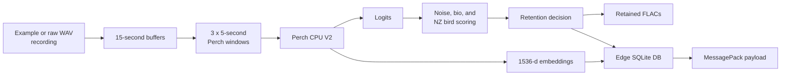
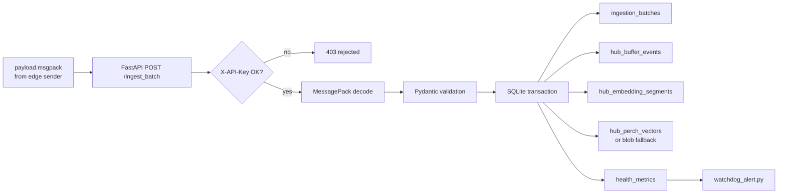
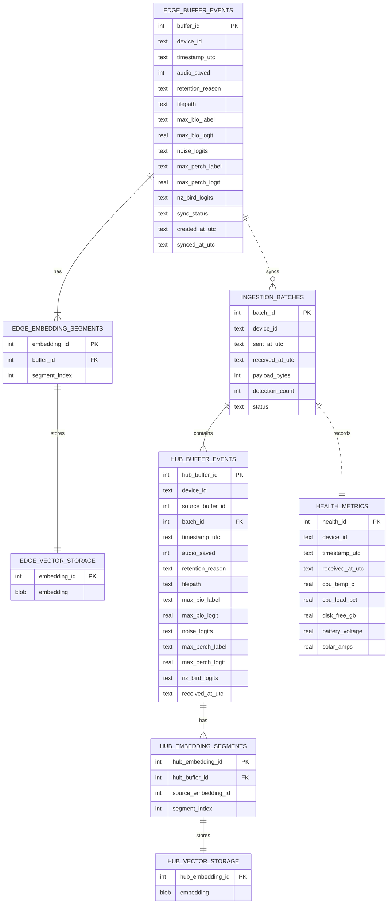

# Edge Bioacoustics

Edge Bioacoustics is a project for remote, low-bandwidth acoustic monitoring of
grey-faced petrels and other North Island New Zealand birds. The system is
designed to capture field audio at the edge, run Perch 2.0 inference locally,
save only selected audio clips, and synchronize compact metadata, logits,
telemetry, and vector embeddings back to a central hub.

The core design goal is simple: keep the field node useful even when power,
storage, weather, and cellular data are all constrained.


## Project Status

The project has completed Phase 1 desktop mock development.

Phase 1 built and tested the full software path locally before moving to real
Raspberry Pi hardware, field microphones, Tailscale networking, 4G transport,
I2C telemetry, and systemd services.

Completed Phase 1 work:

- Desktop mock workspace layout, config templates, dependency files, and
  SQLite setup scripts are in place.
- The configured AR4 mock audio path is
  `/data/petrel_acoustics/raw_audio/doc_ar4/rapanui_AR4_june_2023`.
- Perch CPU V2 inference has been confirmed locally: three 5-second frames from
  one 15-second buffer produce logits shaped `[3, 14795]` and embeddings shaped
  `[3, 1536]`.
- `bio_capture_loop.py` is implemented for bounded desktop runs against raw
  mock audio.
- `ingestion_api.py` is implemented for authenticated MessagePack batch ingest
  into the hub SQLite database.
- `sender_daemon.py` is implemented for MessagePack sync from the edge DB to the
  localhost hub API.
- `watchdog_alert.py` is implemented for healthy, stale, and missing telemetry
  checks against the hub database.
- The end-to-end Phase 1 desktop rehearsal has been run from fresh mock
  databases, with the latest report at
  [docs/02_implementation/phase1_e2e_rehearsal_report.json](docs/02_implementation/phase1_e2e_rehearsal_report.json).
- Known limitations and Phase 2 hardware assumptions are documented at
  [docs/02_implementation/phase1_limitations_and_phase2_assumptions.md](docs/02_implementation/phase1_limitations_and_phase2_assumptions.md).
- A three-notebook teaching sequence walks through the edge capture loop, hub
  ingestion scripts, and full desktop mock system end to end.
- The notebooks use a bundled 120-second teaching clip:
  [notebooks/example_audio/example1_120s_petrel.wav](notebooks/example_audio/example1_120s_petrel.wav).

The current implementation plan is here:

[docs/02_implementation/Phase_1_implementation_plan.md](docs/02_implementation/Phase_1_implementation_plan.md)

## System Overview

The planned system has two main sides.

The edge node is a Raspberry Pi 5 in the field. It captures 48 kHz audio,
processes it as 15-second buffers, downsamples to 32 kHz for Perch 2.0, and
evaluates the three 5-second Perch frames independently. Each buffer produces
metadata, biological and noise scores, NZ bird subset scores, and three
1536-dimensional embeddings.

The central hub is a LattePanda Alpha on a secure home network. It receives
hourly MessagePack batches from the edge node, validates them with a FastAPI
ingestion service, writes them into a WAL-enabled SQLite database, and monitors
device health with a passive watchdog.

## Data Flow

The edge capture path turns continuous audio into compact local evidence. The
same flow is explored interactively in
[notebooks/01_edge_capture_walkthrough.ipynb](notebooks/01_edge_capture_walkthrough.ipynb).



The hub ingestion path receives the edge payload, validates it, and stores the
same detections in the hub database. This flow is explored in
[notebooks/02_hub_ingestion_walkthrough.ipynb](notebooks/02_hub_ingestion_walkthrough.ipynb).



## Runtime Components

The architecture is built around four scripts:

1. `edge_node_mock/src/bio_capture_loop.py`: implemented edge audio buffering, Perch inference, gating, audio retention, and edge database writes.
2. `edge_node_mock/src/sender_daemon.py`: implemented edge database sync, MessagePack serialization, desktop mock telemetry, and HTTP transport.
3. `central_hub_mock/src/ingestion_api.py`: implemented hub-side FastAPI receiver, API key authentication, payload validation, and master database insertion.
4. `central_hub_mock/src/watchdog_alert.py`: implemented hub-side stale telemetry detection and dummy alerting.

Supporting scripts currently include:

- `edge_node_mock/src/audio_smoke_test.py`: confirms configured mock audio can be read.
- `edge_node_mock/src/init_edge_db.py`: initializes the edge SQLite database.
- `edge_node_mock/src/inspect_perch_model.py`: verifies Perch model input/output shapes and label mappings.
- `central_hub_mock/src/init_master_db.py`: initializes the hub SQLite database.

## Data Strategy

Raw recordings are treated as read-only evidence. During desktop development,
mock `.wav` recordings are read from a YAML-configured path under `/data`.
The current AR4 fixture recordings are mono 32 kHz WAV files. The capture loop
also keeps the planned 48 kHz to 32 kHz downsampling path for future sources.

Large raw recordings remain outside Git. A small curated teaching fixture is
tracked under `notebooks/example_audio/` so the walkthrough notebooks can be run
by someone who has just cloned the repository. Generated notebook artifacts are
written under `notebooks/output/`, which is intentionally ignored by Git.

At the edge, the system stores every buffer event and every Perch embedding in
SQLite. Full `.flac` audio is retained only when the buffer is a biological hit
or a scheduled validation sample. This preserves a useful audit trail without
trying to send raw audio over cellular.

Configuration values such as paths, thresholds, API settings, and validation
sampling cadence should live in YAML files rather than being hardcoded into
scripts.

## SQLite Schema

Phase 1 uses one SQLite database at the edge and one at the hub. The diagram
below shows the main tables and the logical relationship between rows. Vector
storage uses `sqlite-vec` when available, with a blob-table fallback recorded in
`schema_metadata`.



## Quick Start

Create or activate the root virtual environment, then install development
dependencies:

```bash
python3 -m venv .venv
.venv/bin/python -m pip install -r requirements-dev.txt
```

Initialize the local mock databases:

```bash
.venv/bin/python edge_node_mock/src/init_edge_db.py --config edge_node_mock/config/edge_config.local.yaml --reset
.venv/bin/python central_hub_mock/src/init_master_db.py --config central_hub_mock/config/hub_config.local.yaml --reset
```

Run the audio and model checks:

```bash
.venv/bin/python edge_node_mock/src/audio_smoke_test.py --config edge_node_mock/config/edge_config.local.yaml
.venv/bin/python edge_node_mock/src/inspect_perch_model.py --config edge_node_mock/config/edge_config.local.yaml
```

Run a bounded capture-loop test:

```bash
.venv/bin/python edge_node_mock/src/bio_capture_loop.py --config edge_node_mock/config/edge_config.local.yaml --iterations 3
```

Start the hub API and send pending edge rows:

```bash
HUB_CONFIG=central_hub_mock/config/hub_config.local.yaml \
  .venv/bin/python -m uvicorn central_hub_mock.src.ingestion_api:app --host 127.0.0.1 --port 8000

.venv/bin/python edge_node_mock/src/sender_daemon.py --config edge_node_mock/config/edge_config.local.yaml --limit 3
```

Preview a sender payload without network traffic:

```bash
.venv/bin/python edge_node_mock/src/sender_daemon.py --config edge_node_mock/config/edge_config.local.yaml --limit 3 --dry-run
```

Run the hub watchdog:

```bash
.venv/bin/python central_hub_mock/src/watchdog_alert.py --config central_hub_mock/config/hub_config.local.yaml
```

The latest end-to-end rehearsal report is stored at:

```text
docs/02_implementation/phase1_e2e_rehearsal_report.json
```

Run the unit tests:

```bash
.venv/bin/python -m unittest tests.test_bio_capture_loop tests.test_ingestion_api tests.test_perch_inspection tests.test_phase1_setup tests.test_sender_daemon tests.test_watchdog_alert
```

## Teaching Notebooks

The notebooks are designed to be run in order. They use the bundled 120-second
clip
[notebooks/example_audio/example1_120s_petrel.wav](notebooks/example_audio/example1_120s_petrel.wav),
which contains wind/sea noise and two grey-faced petrel calls. Each notebook
creates inspectable teaching artifacts under `notebooks/output/`.

1. [notebooks/01_edge_capture_walkthrough.ipynb](notebooks/01_edge_capture_walkthrough.ipynb)
   walks through `bio_capture_loop.py` step by step:

   - Load YAML configuration.
   - Stream the example recording into eight 15-second buffers.
   - Split each buffer into three 5-second Perch windows.
   - Run Perch inference, time each buffer, and inspect logits and embeddings.
   - Apply the configured noise and biological label gates.
   - Save retained `.flac` files.
   - Write edge SQLite rows and a MessagePack payload for the next notebook.

2. [notebooks/02_hub_ingestion_walkthrough.ipynb](notebooks/02_hub_ingestion_walkthrough.ipynb)
   explains the hub scripts by sending the first notebook's MessagePack payload
   through the FastAPI ingestion app, validating auth and malformed-payload
   behavior, inspecting the hub database, and running the watchdog check.

3. [notebooks/03_end_to_end_system_walkthrough.ipynb](notebooks/03_end_to_end_system_walkthrough.ipynb)
   runs the whole desktop mock: edge capture loop, temporary localhost hub API,
   sender daemon dry run, real send, hub database inspection, and watchdog
   summary.

## Repository Map

```text
central_hub_mock/
  config/
  src/

diagrams/
  bioacoustic_IOT_concept.png

docs/
  00_ideas/
  01_concept/
  02_implementation/

edge_node_mock/
  config/
  src/

labels/
  perch_label.csv
  north_island_nz_bird_list.csv
  north_island_nz_perch_lablel.csv

mock_common/
  config.py
  sqlite_vectors.py

notebooks/
  01_edge_capture_walkthrough.ipynb
  02_hub_ingestion_walkthrough.ipynb
  03_end_to_end_system_walkthrough.ipynb
  example_audio/
    example1_120s_petrel.wav
  output/  # generated by the notebooks and ignored by Git

scripts/
  label_extract.py
  match_north_island_perch_labels.py

tests/
```

## Key Documents

- [Architecture concept](docs/01_concept/architecture_concept.md)
- [Phase 1 desktop development concept](docs/01_concept/Phase_1_Desktop_Development.md)
- [Phase 1 implementation plan](docs/02_implementation/Phase_1_implementation_plan.md)
- [Phase 1 schema decisions](docs/02_implementation/schema_decisions.md)
- [Perch model inspection report](docs/02_implementation/perch_model_inspection_report.json)
- [Phase 1 end-to-end rehearsal report](docs/02_implementation/phase1_e2e_rehearsal_report.json)
- [Phase 1 limitations and Phase 2 assumptions](docs/02_implementation/phase1_limitations_and_phase2_assumptions.md)
- [Edge capture teaching notebook](notebooks/01_edge_capture_walkthrough.ipynb)
- [Hub ingestion teaching notebook](notebooks/02_hub_ingestion_walkthrough.ipynb)
- [End-to-end teaching notebook](notebooks/03_end_to_end_system_walkthrough.ipynb)
- [SQLite schema ideas](docs/00_ideas/rpi_sqlite_schema.md)
- [Sound gate notes](docs/00_ideas/sound_gate.md)

## Labels

The `labels/` directory contains the Perch label list and the North Island New
Zealand bird subset used during Phase 1.

The generated file `labels/north_island_nz_perch_lablel.csv` maps Perch label
numbers to local bird common names and scientific names. It is used for the
`nz_bird_logits` field in the planned inference pipeline.

## Development Notes

Phase 1 has proved the system locally with mock data before hardware
integration. The desktop rehearsal path is:

1. Read mock audio from `/data`.
2. Run Perch inference and gating.
3. Write edge SQLite rows with pending sync state.
4. Send pending rows to a localhost FastAPI hub using MessagePack.
5. Mark edge rows as synced only after hub confirmation.
6. Confirm the watchdog can detect healthy, stale, and missing telemetry.

Large audio files, local databases, model exports, secrets, virtual
environments, notebook scratch output, and machine-specific YAML config files
should stay out of Git. The only tracked audio should be small curated teaching
fixtures under `notebooks/example_audio/`.

## License

This project is licensed under the GNU General Public License v3.0. See
[LICENSE](LICENSE) for the full license text.
